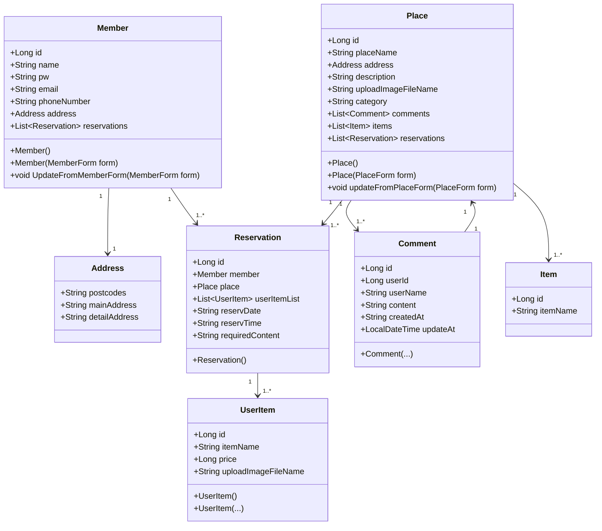

 

안녕하세요! 
이상훈 의 Github 개인 프로젝트 ReservationShop 입니다!

**sanghoon23@naver.com**

  
## 사용 기술

 

   

## 개발 환경

 

- IDE: IntelliJ IDEA
- Java: 17
- Framework: Spring Boot 3.3.3
- ORM: JPA
- DB: Oracle, MySQL
- Build Tool: Gradle
- Template Engine: Thymeleaf
- Version Control: Git

   
## 목차

 

- [프로젝트 소개](#프로젝트-소개)
- [구현 기능](#구현-기능)
- [엔티티 구조](#엔티티-구조)

  
## 프로젝트 소개

  
네이버 예약 시스템을 바탕으로 개발한 개인 프로젝트입니다.

  
## 구현 기능
 

 

 

  
1. SpringSecurity 기반 OAuth2 로그인 인증 방식 구현 (Google, Naver, Kakao) 및 회원가입 
2. 주소 API, 카카오 맵 API 활용   
3. 댓글 기능 
4. 장소 등록 및 상품 등록 
5. 예약하기 
6. 마이페이지, 관리자 페이지 

  
## 엔티티 구조

  

